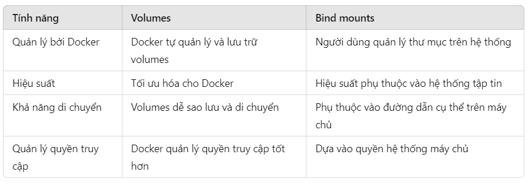

# Volumes trong docker

  

  <b>Volumes: </b>
  

  
  + Volumes trong Docker là một tính năng cho phép bạn lưu trữ và chia sẻ dữ liệu giữa các container hoặc giữa container và máy chủ (host). Nó được sử dụng để duy trì dữ liệu của container ngay cả khi container bị dừng hoặc xóa.
  + <b> Cáclệnh cơ bản: </b>
      - Xem danh sách volumes: `docker volume ls`
      - Xóa volume: `docker volume rm my-volume`
  + <b> Tại sao nên dùng volumes? </b>
      - <b> Persist dữ liệu: </b> Dữ liệu trong container thường sẽ bị mất khi container bị xóa. Volumes giúp lưu trữ dữ liệu một cách lâu dài, ngay cả khi container không còn tồn tại.
      - <b> Chia sẻ dữ liệu giữa các container: </b> Nhiều container có thể sử dụng chung một volume để chia sẻ dữ liệu. Điều này rất hữu ích khi bạn có các container cần truy cập vào cùng một bộ dữ liệu.
      - <b> Tách biệt dữ liệu và ứng dụng: </b> Volumes giúp tách biệt dữ liệu khỏi container, giúp việc quản lý và sao lưu dữ liệu trở nên dễ dàng hơn.
      - <b> Hiệu suất tốt hơn: </b> Volumes được tối ưu hóa cho hiệu suất và thường nhanh hơn so với việc lưu trữ dữ liệu trực tiếp trên hệ thống tập tin của container (bind mounts).

  + <b> Cách sử dụng volumes: </b>
      1. Tạo volume: `docker volume create my-volume` 
      2. Gắn volume vào container:
          - Khi chạy container, bạn có thể gắn volume vào một thư mục trong container bằng tùy chọn -v hoặc --mount.
          - `docker run -d -v my-volume:/path/in/container my-image`
              + `my-volume` : Tên của volume mà bạn đã tạo.
              + `/path/in/container` : Đường dẫn trong container nơi volume sẽ được gắn.
          - EX:
              + Nếu bạn muốn lưu trữ dữ liệu trong thư mục /data của container:
              + `docker run -d -v my-volume:/data my-image `
      3. Bind mounts:
           - Ngoài ra, bạn cũng có thể gắn một thư mục từ máy chủ (host) vào container. Đây là dạng bind mounts:
           - `docker run -d -v /path/on/host:/path/in/container my-image`
              + `/path/on/host` : Thư mục trên máy chủ mà bạn muốn gắn.
              + `/path/in/container` : Thư mục tương ứng trong container.
      4. So sánh giữa volumes và bind mounts:
           
      5. Ví dụ cụ thể:
         - Giả sử bạn có một ứng dụng web lưu trữ dữ liệu vào thư mục /data bên trong container và bạn muốn dữ liệu được lưu trữ bền vững trên máy chủ của bạn. Bạn có thể sử dụng volume như sau:
              + `docker run -d -v my-volume:/data my-web-app`
         - Nếu bạn muốn sử dụng một thư mục cụ thể trên máy chủ (ví dụ /home/user/data), bạn có thể sử dụng bind mount:
              + `docker run -d -v /home/user/data:/data my-web-app`

## Lưu ý:
  - Anonymous Volume sẽ bị xóa khi container shutdown
- Volume được đặt tên sẽ không tự động xóa khi container shutdown
        + EX: `docker run -d -p 3000:80 --rm --name feedback-app -v feedback:/app/feedback feedback-node:volumes`  

